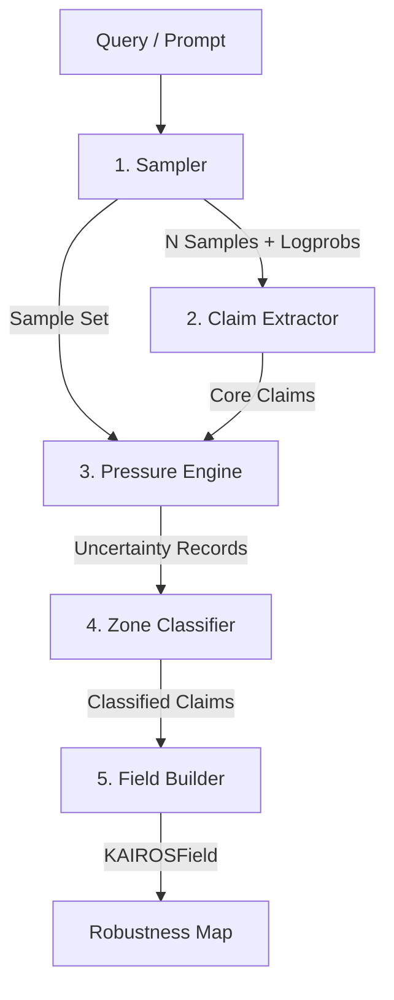

# KAIROS: Knowledge Assessment via Inference of Robustness and Uncertainty Systems

KAIROS is a framework for **AI uncertainty analysis** designed to dissect LLM generations, extract their core factual claims, and map out their stability zones. By combining token-level epistemic entropy, semantic consistency, and structural gradients under counterfactual perturbations, KAIROS identifies which claims are robust ("Solid") and which ones reside on unstable boundaries ("Fault Lines").

---

## Architecture & Core Pipeline

KAIROS processes a prompt through a multi-stage pipeline, culminating in a structured uncertainty field (`KAIROSField`).



### 1. Sampling (`sampler.py`)
Generates $N$ response samples from a local Ollama model (defaulting to `llama3.2`) with a temperature parameter $\tau$ (typically $0.7$ or $0.8$). It captures both the raw text responses and the token-level log-probabilities (including `top_logprobs`) to reconstruct the generation-probability distribution.

### 2. Claim Extraction (`claim_extractor.py`)
Extracts individual factual assertions from the primary (first) sample. It prompts the model to decompose the response text into a numbered list of atomic, standalone, and self-contained claims.

### 3. Epistemic Entropy Engine (`entropy_engine.py`)
Estimates token-level Shannon entropy over the generation.
- **Aleatoric Entropy** is the expected entropy of individual predictions (representing raw token noise).
- **Epistemic Entropy** measures the divergence between the average prediction across samples (mixture) and the individual samples' predictions. This isolates model uncertainty from syntactic variety. 
- Claims are mapped to corresponding token indices in the text, and the maximum normalized epistemic entropy ($H_{e\_norm}$) in that span is computed.

### 4. Structural Gradient Engine (`gradient_engine.py`)
Measures the dependency of the entire answer on a single claim. It instructs the model to regenerate the response under the counterfactual assumption that the claim is **false**.
- The semantic distance ($1 - \text{CosineSimilarity}$) between the original answer and the perturbed answer represents the **structural gradient** ($G_{norm}$). 
- High gradient indicates that removing the claim collapses or radically alters the overall explanation.

### 5. Consistency Engine (`consistency_engine.py`)
Computes semantic consistency ($Cons$) of each claim across all generated samples. It finds the most semantically matching sentence in each secondary sample and calculates average pairwise similarity.
- $1 - Cons$ gives the **inconsistency** score.

### 6. Pressure Engine (`pressure_engine.py`)
Combines the three components into a single metric, **Uncertainty Pressure** ($U$):
\[
U = H_{e\_norm} \times G_{norm} \times (1 - Cons)
\]
Where $U$ is clamped to the range $[0.0, 1.0]$. 

---

## Uncertainty Zones

Claims are categorized into three stability zones in `zone_classifier.py` based on their uncertainty pressure ($U$):

| Zone | Threshold | Description |
|---|---|---|
| **SOLID** | $U < 0.20$ | High consistency, low epistemic entropy. The model reliably knows and generates this claim. |
| **GRADIENT** | $0.20 \le U < 0.60$ | Transition zone. Moderate uncertainty or minor dependency. |
| **FAULT LINE** | $U \ge 0.60$ | High uncertainty pressure. The claim is highly volatile, semantically inconsistent, or structurally unstable. |

---

## Core Dataclasses & API

### `KAIROSField`
An orchestrator object representing the processed field:
* `query` (`str`): The initial user question.
* `answer` (`str`): The primary answer generated.
* `total_claims` (`int`): Count of extracted assertions.
* `N_samples` (`int`): Count of samples generated.
* `records` (`list[dict]`): List of all classified uncertainty records.
* `fault_lines` (`list[dict]`): Volatile claims.
* `gradients` (`list[dict]`): Transitionary claims.
* `solid` (`list[dict]`): Robust, stable claims.

---

## Setup & Execution

### Prerequisites
1. **Python 3.10+**
2. **Ollama** installed and running locally with the `llama3.2` model pulled:
   ```bash
   ollama pull llama3.2
   ```

### Installation
Clone the repository and install the dependencies:
```bash
pip install numpy sentence-transformers requests torch
```

### Running the Orchestrator
You can run the field builder on a query by running `field_builder.py` directly:
```bash
python field_builder.py
```

### Running the Experiment Suite
The `experiment.py` script runs KAIROS on a benchmark set of 10 trivia and scientific questions, mapping out lift ratios between Fault Lines and Solid zones to validate the predictive signal of the pipeline:
```bash
python experiment.py
```

---

## Mathematical Formulation

### Epistemic Entropy ($H_e$)
Given a token distribution mixture $M = \frac{1}{N} \sum_{n=1}^N P_n$ at position $t$:
\[
H_{\text{total}} = -\sum_{w} M(w) \log_2 M(w)
\]
\[
H_{\text{aleatoric}} = \frac{1}{N} \sum_{n=1}^N \left( -\sum_{w} P_n(w) \log_2 P_n(w) \right)
\]
\[
H_e = H_{\text{total}} - H_{\text{aleatoric}}
\]
Normalized by the maximum possible vocabulary entropy:
\[
H_{e\_norm} = \frac{\max(0, H_e)}{\log_2(\text{vocab\_size})}
\]

### Structural Gradient ($G$)
Let $A$ be the original answer and $A'_c$ be the perturbed answer generated assuming claim $c$ is false. Let $E(x)$ be the sentence embedding of text $x$:
\[
G(c) = 1.0 - \text{CosineSimilarity}(E(A), E(A'_c))
\]
